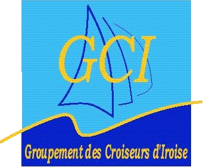

# Groupement des Croiseurs de l'Iroise

Le G.C.I est une association de clubs de voile qui ont décidé de coordonner leurs efforts pour développer la pratique de la voile sur bateaux de type habitable.
Aujourd'hui, huit clubs forment le G.C.I. :

* Brest Bretagne Nautisme
* Club Nautique de la Marine à Brest
* Centre Nautique de Roscanvel
* Centre Nautique de Rostiviec
* Club de Voile Ailée de l'École Navale
* Saint Hernot Yacht Club
* Voiles du Ponant 29
* Yacht club de la rade de Brest

